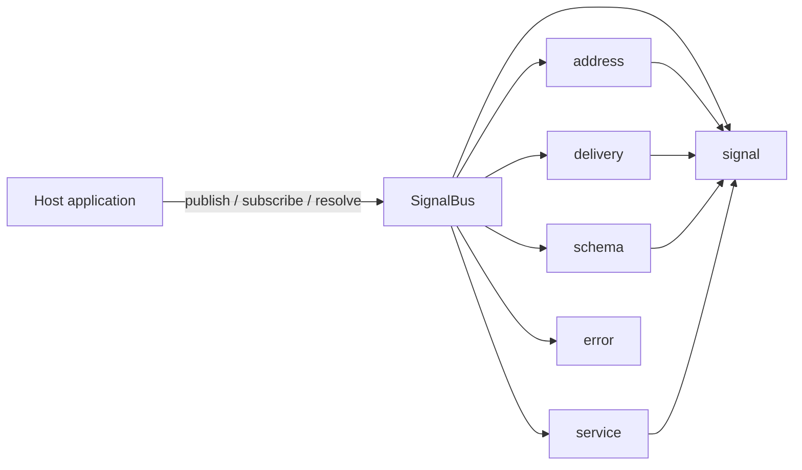
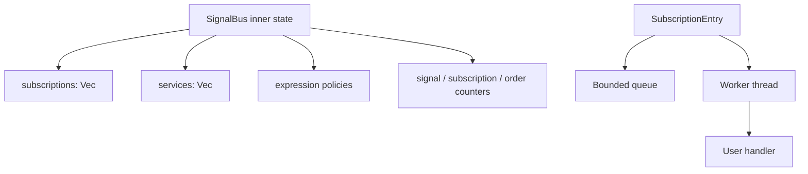

# SPINE Architecture

SPINE is an embedded, in-process signal address bus. The current implementation is a single Rust crate with a small set of focused modules:

- `address` for parsing and canonicalising concrete addresses and expressions
- `bus` for subscription, publish, queueing, and service resolution
- `delivery` for delivery policy types
- `schema` for schema descriptors and signal metadata
- `service` for service registration and lookup helpers
- `signal` for envelopes, payloads, and match specificity
- `error` for shared error types

## Component View

## Runtime Structure

The bus keeps its state in a single shared inner structure guarded by a mutex:

- registered subscriptions
- registered services
- expression-level delivery policies
- counters for signal IDs, subscription IDs, and registration order

Each subscription owns:

- an address expression
- a payload schema descriptor
- delivery options
- a bounded queue
- a dedicated worker thread

## Design Notes

- Matching is selective. Only expressions that match an address are enqueued.
- Delivery is bounded. Each subscriber queue has a maximum depth.
- Handlers are isolated. Each subscription has its own worker thread.
- Service lookup uses the same address matcher as subscriptions.
- The implementation does not open sockets, expose IPC, or persist state.

## Current MVP Tradeoffs

This implementation favors clarity and correctness over route-index sophistication:

- subscriptions are scanned from an in-memory list
- matching is deterministic through a specificity comparator
- delivery queues are bounded and backpressure-aware
- handler execution is separated from publish-path routing

That keeps the MVP small while preserving the core routing semantics.

