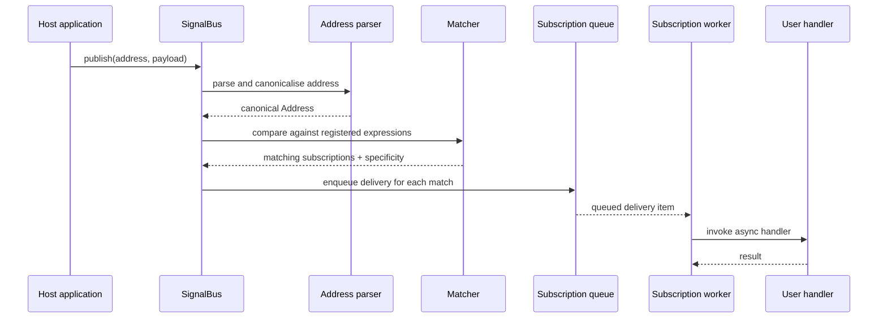
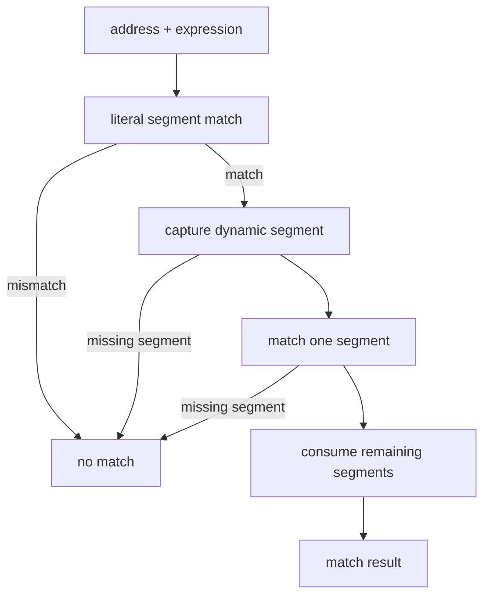
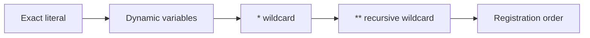
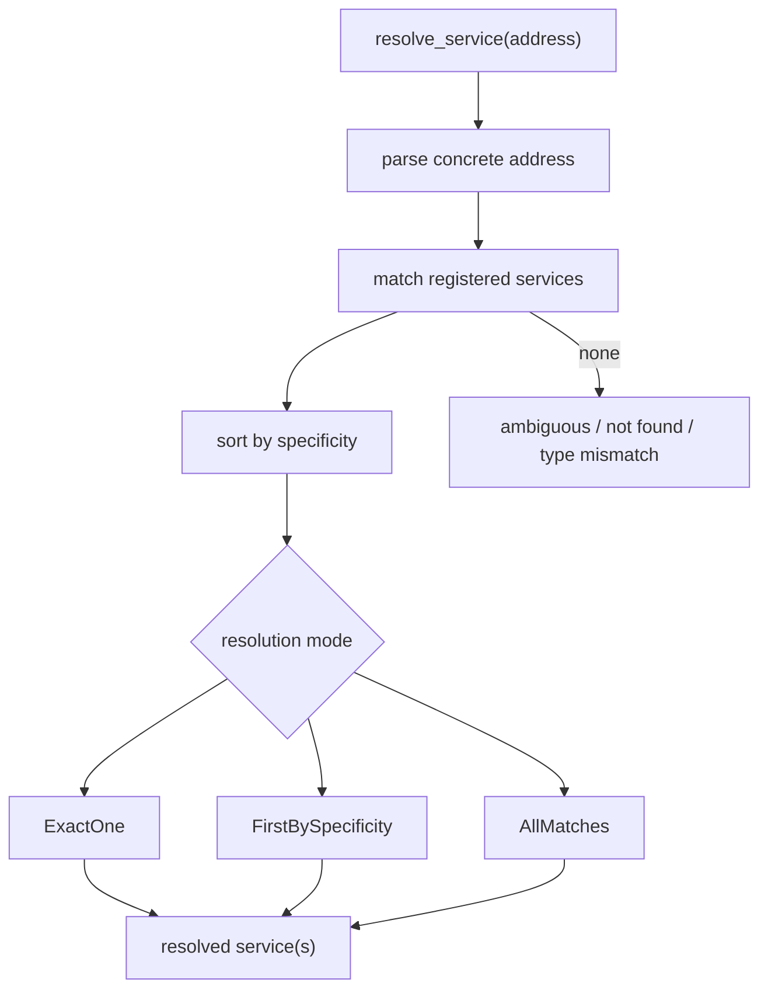

# SPINE Routing and Delivery Logic

This document describes how an address moves through the current MVP implementation.

## Address and Expression Forms

- Concrete addresses are slash-separated paths such as `documents/abc/blocks/42/changed`
- Expressions may contain:
  - literal segments
  - dynamic variables like `{document_id}`
  - single-segment wildcards `*`
  - a final recursive wildcard `**`

## Publish Path

## Matching Rules

The matcher works segment-by-segment:

1. Literal segments must match exactly.
2. Dynamic segments capture one address segment under the variable name.
3. `*` matches one segment without capture.
4. `**` matches the remaining segments and must be the final expression segment.

If an address does not match an expression, that subscriber is never notified.

## Specificity Ordering

When more than one expression matches the same address, the bus sorts by specificity:

1. More literal segments first
2. More dynamic segments next
3. Fewer `*` wildcards next
4. Fewer recursive wildcards next
5. Shorter recursive matches next
6. Registration order as the final tiebreaker

This gives deterministic routing and service resolution.

## Delivery Logic

The current MVP delivery path is:

1. Parse and canonicalise the address
2. Generate the signal schema from the payload type
3. Resolve matching subscriptions
4. Enqueue delivery on each matched subscription queue
5. Let the subscription worker invoke the handler

Queue overflow is handled by the configured overflow policy. The current implementation supports bounded queues and a reject-on-overflow default.

## Service Lookup

Service resolution reuses the same matcher:

## Implementation Notes

- Handlers run on worker threads, so a slow handler does not block the publish path.
- Handler panic is isolated to that worker thread.
- The bus does not expose payloads to non-matching subscribers.
- Expression configuration can be registered separately and used as a default when subscribing with default delivery options.

