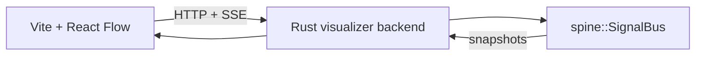

# SPINE Visualizer

This example pairs a Vite frontend with a small Rust backend that runs the real `spine` crate and can load named scenarios into the graph.



## Run

```bash
cd examples/visualizer
pnpm install
pnpm dev
```

In another terminal:

```bash
cargo run --manifest-path backend/Cargo.toml
```

The frontend proxies `/api` to the Rust server on `127.0.0.1:8787`.

Scenario presets now live in [`scenarios/`](./scenarios) as JSON. The Rust backend owns loading and saving those files, and the frontend reads scenario metadata from the backend instead of keeping a separate hard-coded list.

## What it shows

- Scenario loading, so the frontend can reset the backend to a named graph preset
- Scenario JSON saving, so graph/config edits can be written back to the preset file
- A cafe pipeline scenario with client-side logic that publishes live payloads into the Rust bus
- Queueing, concierge greeting, waiter dispatch, kitchen stages, billing, payment, and turnover modeled as long-running traffic
- Configurable arrival timing, customer wait windows, dish prices, dish prep times, and tip thresholds in the frontend
- A bus config node with catch-all and recursion controls
- Scenario-driven Manhattan edges with a deterministic end-to-end process graph
- Queue cards that show live waiting customers, waiter tasks, tickets, bills, and occupied tables
- A live trace panel showing payloads accepted or dropped per subscriber
- Real publish results generated by `spine::SignalBus`
