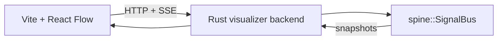

# SPINE Visualizer

This example pairs a Vite frontend with a small Rust backend that runs the real `spine` crate and loads a café service-flow scenario by default.



## Run

```bash
cd examples/visualizer
pnpm install
pnpm dev
```

In another terminal:

```bash
cargo run --manifest-path backend/Cargo.toml
```

The frontend proxies `/api` to the Rust server on `127.0.0.1:8787`.

## What it shows

- A queue of cafe arrivals, table turnover, menu drops, orders, kitchen prep, food service, billing, and payment
- Publisher nodes that drive the story beat by beat
- Subscriber nodes that watch the queue, the floor, the kitchen, and the seated customer
- A bus config node with catch-all and recursion controls
- React Flow routes that update from the backend's live route matching
- A live trace panel showing payloads accepted or dropped per subscriber
- A `Play cafe story` control that runs the full sequence
- Real publish results generated by `spine::SignalBus`
