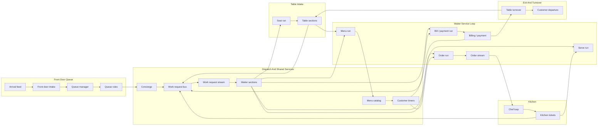

# Cafe Pipeline Flow

This diagram matches the current runtime node and edge definition in [`../scenarios/cafe-pipeline.json`](../scenarios/cafe-pipeline.json).

## Node Mapping

| Mermaid | Scenario node id |
| --- | --- |
| `arrivals` | `publisher-arrivals` |
| `frontDoor` | `subscriber-front-door` |
| `queueManager` | `publisher-queue` |
| `queueRules` | `subscriber-queue` |
| `concierge` | `publisher-concierge` |
| `waiterRouter` | `publisher-waiter-router` |
| `requestStream` | `subscriber-router` |
| `menuCatalog` | `service-menu-catalog` |
| `customerTimers` | `publisher-diner` |
| `waiterPool` | `service-waiter-pool` |
| `seatRun` | `publisher-seating` |
| `tableSections` | `subscriber-tables` |
| `menuRun` | `publisher-menu` |
| `orderRun` | `publisher-order` |
| `serveRun` | `publisher-service` |
| `billingRun` | `publisher-billing` |
| `orderStream` | `subscriber-orders` |
| `chefLoop` | `publisher-kitchen` |
| `kitchenTickets` | `subscriber-kitchen` |
| `billingState` | `subscriber-billing` |
| `turnover` | `publisher-turnover` |
| `departures` | `publisher-departures` |
